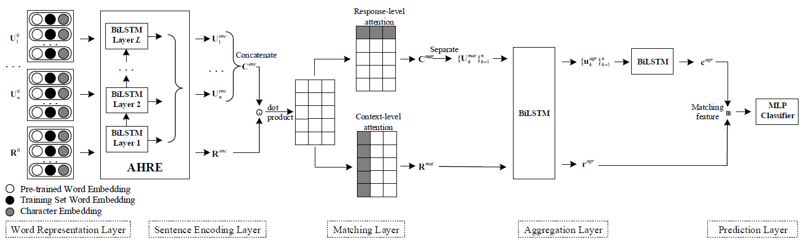
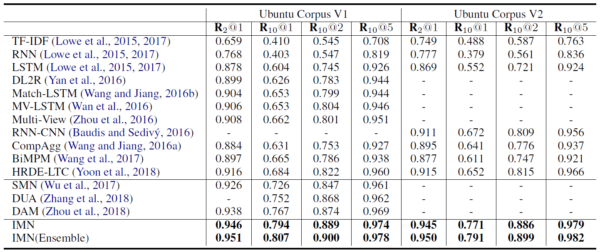
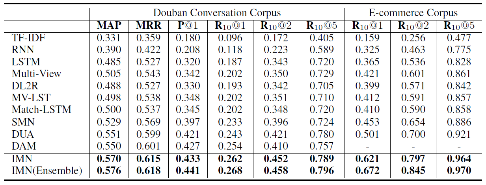

# Interactive Matching Network for Multi-Turn Response Selection
This repository contains the source code and datasets for the CIKM 2019 paper [Interactive Matching Network for Multi-Turn Response Selection in Retrieval-Based Chatbots](http://delivery.acm.org/10.1145/3360000/3358140/p2321-gu.pdf?ip=118.143.40.9&id=3358140&acc=OPEN&key=4D4702B0C3E38B35%2E4D4702B0C3E38B35%2E4D4702B0C3E38B35%2E6D218144511F3437&__acm__=1572786319_fefb7f9aac0654be961f615a505293b0) by Gu et al. <br>

Our proposed Interactive Matching Network (IMN) has achieved a new state-of-the-art performance on four large-scale datasets that are publicly available for research on multi-turn conversation.

## Model overview


## Results



## Dependencies
Python 2.7 <br>
Tensorflow 1.4.0

## Datasets
Your can download the processed datasets used in our paper here and unzip it to the folder of ```data```. <br>
[Ubuntu_V1](https://drive.google.com/open?id=1-rNv34hLoZr300JF3v7nuLswM7GRqeNc) <br>
[Ubuntu_V2](https://drive.google.com/open?id=1tS_VC47z8CVPr-tZu0U4JEEwBT04N6ks) <br>
[Douban](https://drive.google.com/open?id=1Cwt5BC_WDr1N_-TYaOMSHuOXLKAxXoMQ) <br>
[Ecommerce](https://drive.google.com/open?id=1vy2bcTCLm1Dzsdvh0cvPIw0XzrTK06us)

## Train a new model
Take Ubuntu_V1 as an example.
```
cd scripts
bash ubuntu_train.sh
```
The training process is recorded in ```log_train_IMN_UbuntuV1.txt``` file.

## Test a trained model
```
bash ubuntu_test.sh
```
The testing process is recorded in ```log_test_IMN_UbuntuV1.txt``` file. And your can get a ```ubuntu_test_out.txt``` file which records scores for each context-response pair. Run the following command and you can compute the metric of Recall.
```
python compute_recall.py
```

## Cite
If you use the code and datasets, please cite the following paper:
**"Interactive Matching Network for Multi-Turn Response Selection in Retrieval-Based Chatbots"**
Jia-Chen Gu, Zhen-Hua Ling, Quan Liu. _CIKM (2019)_

```
@inproceedings{Gu:2019:IMN:3357384.3358140,
 author = {Gu, Jia-Chen and 
           Ling, Zhen-Hua and 
           Liu, Quan},
 title = {Interactive Matching Network for Multi-Turn Response Selection in Retrieval-Based Chatbots},
 booktitle = {Proceedings of the 28th ACM International Conference on Information and Knowledge Management},
 series = {CIKM '19},
 year = {2019},
 isbn = {978-1-4503-6976-3},
 location = {Beijing, China},
 pages = {2321--2324},
 url = {http://doi.acm.org/10.1145/3357384.3358140},
 doi = {10.1145/3357384.3358140},
 acmid = {3358140},
 publisher = {ACM},
} 
```
